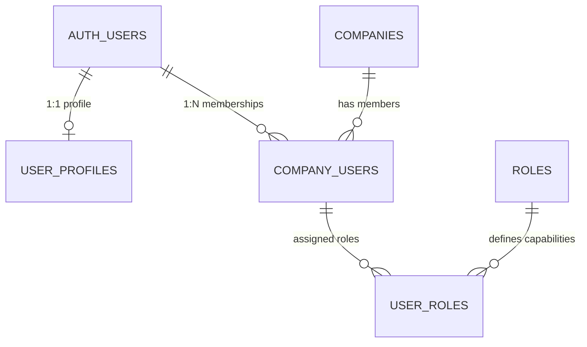

# PrintFlow — Multi-Tenant Architecture & Security Specification

**Version:** 2.0.0  
**Status:** Approved Architecture  
**Author:** Senior Full-Stack & Security Engineer  

---

## 1. Architectural Invariants

1. **Host-Derived Tenant Scope:** The tenant context is ALWAYS derived from the verified request host (or path fallback in PSL/development mode). It is NEVER accepted from client-supplied headers, request bodies, or URL parameters.
2. **Host-Only Cookies:** All session cookies (`sb-*-auth-token`, `printflow_tenant_session`, legacy reader support) are host-only. The `Domain` attribute is NEVER set to `.ROOT_DOMAIN` (no wildcard cookies). Platform cookies and tenant cookies never share host scope or storage.
3. **Defense in Depth (DAL as Real Boundary):** Edge middleware performs routing and session refresh, but the server-side Data Access Layer (`lib/auth/dal.ts`) is the authoritative security boundary. Every Server Action, Route Handler, and Server Component independently authenticates and authorizes.
4. **PostgreSQL RLS as the Ultimate Barrier:** All tenant tables carry a non-null tenant/company identifier, have Row-Level Security enabled and FORCED (`FORCE ROW LEVEL SECURITY`), with non-bypassable policies checking verified identity and active membership.
5. **No Blind Trust of Claims:** JWT claims provide fast token-based routing, but sensitive operations re-verify against the active database membership so suspended or removed users lose access immediately.

---

## 2. Domain & Host Topology

```
+-----------------------------------------------------------------------------------+
|                                   INTERNET                                        |
+-----------------------------------------------------------------------------------+
         |                                |                               |
         v                                v                               v
+------------------+            +-------------------+           +-------------------+
|   ROOT DOMAIN    |            |  PLATFORM ADMIN   |           |  TENANT SUBDOMAIN |
|   printflow.bd   |            | admin.printflow.bd|           |[slug].printflow.bd|
+------------------+            +-------------------+           +-------------------+
         |                                |                               |
         | Rewrites                       | Rewrites                      | Rewrites
         v                                v                               v
+------------------+            +-------------------+           +-------------------+
|  app/(marketing) |            |   app/(platform)  |           |    app/(tenant)   |
|  - Landing       |            |   - Tenants       |           |   - Login/Staff   |
|  - Registration  |            |   - Subscriptions |           |   - Invoices/POS  |
|  - Find-Workspace|            |   - Support/Audit |           |   - Production    |
+------------------+            +-------------------+           +-------------------+
```

### A. Host Classification

| Host Type | Domain Pattern | Target Experience | Cookie Scope |
| :--- | :--- | :--- | :--- |
| **Marketing / Root** | `ROOT_DOMAIN` (`printflow.bd`, `localhost:3000`) | Landing page, workspace discovery, tenant registration, legal pages | Host-only (`printflow.bd`) |
| **Platform Owner** | `admin.ROOT_DOMAIN` (`admin.printflow.bd`, `admin.localhost`) | Platform administration, subscriptions, tenant audit, metrics | Host-only (`admin.printflow.bd`) |
| **Tenant Portal** | `[tenantSlug].ROOT_DOMAIN` (`vision.printflow.bd`) | Tenant business operations, billing, inventory, POS, employee login | Host-only (`vision.printflow.bd`) |
| **Custom Domain** | `erp.customerdomain.com` (verified in `tenant_domains`) | Same as tenant portal, branded for customer | Host-only (`erp.customerdomain.com`) |
| **PSL / Dev Fallback**| `printflow.bd/t/[slug]/*` or `/[slug]/*` | Path-based fallback when wildcard DNS is unavailable | Host-only on fallback host |

### B. Vercel Wildcard & DNS Configuration
- Wildcard subdomains (`*.ROOT_DOMAIN`) require custom nameservers pointed to Vercel:
  - `ns1.vercel-dns.com`
  - `ns2.vercel-dns.com`
- Wildcards on `*.printflow.bd` are mathematically and architecturally impossible because `vercel.app` is an entry on the Public Suffix List (PSL).
- In development and preview environments (`*.vercel.app`), the system automatically switches to path-based tenant isolation (`/[tenantSlug]/...`) with identical security gates.

---

## 3. Route Groups & Rewrite Scheme

To ensure zero route collision and prevent direct access to internal rewrite endpoints:
1. **Public/Marketing Group (`app/(marketing)`):**
   - Renders at root host `ROOT_DOMAIN`.
   - Routes: `/`, `/register`, `/find-workspace`, `/pricing`, `/about`, `/contact`, `/terms`, `/privacy`.
2. **Tenant Operations Group (`app/(tenant)` / `app/[tenantSlug]`):**
   - Renders at tenant subdomains `[tenantSlug].ROOT_DOMAIN`.
   - Subdomain requests (e.g. `https://vision.ROOT_DOMAIN/billing`) are internally rewritten to `/[tenantSlug]/billing`.
   - **Internal Route Protection:** Direct HTTP requests arriving with a tenant slug in the URL on a subdomain (e.g. `https://vision.ROOT_DOMAIN/vision/billing`) are normalized via 307 redirect to `https://vision.ROOT_DOMAIN/billing`.
   - External requests to root domain attempting to access `/[tenantSlug]/*` are redirected to canonical subdomain `https://[tenantSlug].ROOT_DOMAIN/*` in production mode.
3. **Platform Group (`app/platform`):**
   - Accessible ONLY on `admin.ROOT_DOMAIN`.
   - Direct requests to `/platform` from tenant subdomains or root domain are blocked (404/redirect).

---

## 4. Identity & Membership Model

The application adopts the **Single Identity, Multiple Membership** architecture:
- **`auth.users`:** Global identity entity managed by Supabase Auth (email, password hash, MFA factors).
- **`user_profiles`:** 1:1 metadata profile attached to `auth.users.id` (name, phone, avatar, preferred locale).
- **`company_users` (Tenant Membership):**
  - Columns: `id (UUID)`, `company_id (UUID)`, `user_id (UUID)`, `branch_id (UUID)`, `status ('active' | 'invited' | 'suspended' | 'disabled')`, `is_active (BOOLEAN)`, `responsibilities (TEXT[])`, `created_at (TIMESTAMPTZ)`.
  - Composite Unique Constraint: `UNIQUE (company_id, user_id)`.
- **`user_roles`:** Maps `company_users.id` to specific application roles (`roles.id`).



A user's session in the application is **strictly scoped to ONE active tenant**, determined by the request host. If User A logs in on `alpha.ROOT_DOMAIN`, their active context is solely `alpha`. They cannot query or modify `beta` without authenticating on `beta.ROOT_DOMAIN`.

---

## 5. Employee Credentials & Authentication Flow

1. **Employee Provisioning:**
   - Business owners/managers add employees via `WorkforceService.createEmployee()`.
   - Fields: Full Name, Role, Mobile Phone, Username (optional), Counter/Branch.
   - Credentials options:
     - **Invite Link:** Expiring 72-hour cryptographic token sent via SMS/WhatsApp/Email.
     - **Temporary Password:** Generated server-side with forced password reset on first login (`must_change_password = true`).
2. **Synthetic Identity Resolution:**
   - Employees who lack an email address receive a deterministic, tenant-isolated synthetic identity:
     `{sanitized_username}@{company_slug}.printflow.internal`
   - The synthetic email is strictly internal and NEVER exposed to users or client code.
3. **Server-Side Credential Resolver:**
   - Employee enters: `Username or Phone` + `Password`.
   - `AuthService.resolveLoginEmail(identifier, companySlug)`:
     - Matches `username` against `company_users` and `employees` *strictly scoped to the active tenant's `company_id`*.
     - Matches `phone` against normalized phone numbers in the active tenant.
     - Resolves the matching internal email address.
   - Calls `supabase.auth.signInWithPassword()` using verified email and password.
4. **Zero Cross-Tenant Fallback:**
   - If an employee or user attempts to log into `beta.ROOT_DOMAIN` with credentials that belong to `alpha.ROOT_DOMAIN`, the resolver fails closed. It NEVER falls back to another tenant.
   - Generic error returned: *"Invalid username, mobile number, or password."* (Zero user enumeration).

---

## 6. Access Token Claims & Real-Time Invalidation

### A. JWT Claims Structure
Via a custom Supabase Auth Hook (or access token enrichment), authenticated JWTs contain:
```json
{
  "app_metadata": {
    "tenant_id": "00000000-0000-0000-0000-000000000001",
    "company_slug": "vision-print",
    "role": "cashier",
    "member_status": "active"
  }
}
```

### B. Immediate Revocation Safeguard
Because JWTs can remain valid until expiration (e.g. 1 hour), **the Data Access Layer (`lib/auth/dal.ts`) validates the user's active status against the database on every authenticated request**:
- If `company_users.status != 'active'` or `companies.is_active != true`:
  - `dal.requireTenantUser()` immediately terminates the request with 403 Forbidden.
  - The session cookies are cleared.
  - Deactivated employees lose access **in under 5 seconds**, not after JWT expiry.

---

## 7. Role Hierarchy & Enforced RBAC Matrix

| Role | Slug | Key Capabilities | Restricted Areas |
| :--- | :--- | :--- | :--- |
| **Business Owner** | `business_owner`, `owner` | Full operational and financial control, company settings, subscription, user provisioning | Platform administration |
| **General Manager** | `manager`, `system_admin` | Operational oversight, staff management, approvals, discounts | Subscription billing, company deletion |
| **Accountant** | `accountant` | Invoices, payments, expense ledger, VAT/tax, financial reports | User management, company settings |
| **Cashier / POS Operator** | `cashier` | Quick POS billing, invoice generation, customer intake, payment receipt | Expense approval, profit reports, delete records |
| **Production Manager** | `production_manager` | Work orders, job scheduling, machine allocation, material issues | Financial reports, customer payments |
| **Operator / Craftsman** | `operator` | Job order progress updates, time tracking, stage completion | Pricing, costs, customer financials |
| **Designer** | `designer` | Design proofs, file attachments, artwork approval | Invoicing, payments, inventory |
| **Viewer / Auditor** | `viewer` | Read-only inspection of reports and registers | Any create, edit, or delete action |

*Security Rule:* UI hiding (omitting navigation items) is merely a convenience. All roles are strictly validated on the server via `requireRole()` / `requirePermission()` in `dal.ts` and in PostgreSQL RLS policies.

---

## 8. Platform Admin Isolation & Support Mode

1. **Physical Isolation:**
   - Platform admin code lives under `app/platform`.
   - Runs exclusively on `admin.ROOT_DOMAIN`.
   - Authenticates against `platform_admins` table (never against `company_users`).
2. **Support Mode ("Impersonate Tenant"):**
   - Platform admins cannot arbitrarily read tenant data without an audit-backed support session.
   - Requirements:
     - Active platform admin session + valid MFA.
     - Mandatory business reason logged in `platform_support_sessions`.
     - Time-limited (default 60 minutes).
     - Read-only by default (`access_level = 'read_only'`).
     - Persistent top-docked warning banner rendered across all pages (`ImpersonationBanner`).

---

## 9. Cookie Isolation & Security Configuration

All cookies are hardened to prevent XSS exfiltration, CSRF, and cross-subdomain leaks:

```ts
export const COOKIE_CONFIG = {
  tenantSession: {
    name: 'printflow_tenant_session',
    httpOnly: true, // NEVER accessible via document.cookie
    secure: process.env.NODE_ENV === 'production',
    sameSite: 'lax' as const,
    path: '/',
    maxAge: 60 * 60 * 24 * 7, // 7 days
    domain: undefined, // HOST-ONLY: No wildcard domain!
  },
  platformSession: {
    name: 'printflow_platform_session',
    httpOnly: true,
    secure: process.env.NODE_ENV === 'production',
    sameSite: 'strict' as const,
    path: '/platform',
    maxAge: 60 * 60 * 8, // 8 hours
    domain: undefined, // HOST-ONLY on admin host
  },
}
```

---

## 10. Data Access Layer (`lib/auth/dal.ts`) Specification

The DAL is the single point of truth for server components, Server Actions, and Route Handlers:
```ts
import 'server-only'

// Request-scoped cached helpers
export const getTenant = cache(async (): Promise<TenantContext | null> => { ... })
export const requireTenant = async (): Promise<TenantContext> => { ... }
export const requireRole = async (allowedRoles: string[]): Promise<TenantContext> => { ... }
export const requirePermission = async (permissionCode: string): Promise<TenantContext> => { ... }
export const getScopedDbClient = async () => { ... } // Returns Supabase client bound to caller's verified RLS token
```

---

## 11. Database Hardening (Phase 8 Specification)

1. **`FORCE ROW LEVEL SECURITY`:**
   Execute `ALTER TABLE public.[table] FORCE ROW LEVEL SECURITY;` across all 191 tables to ensure superuser and table-owner roles cannot bypass tenant isolation.
2. **Child Table RLS Enforcement:**
   Add explicit RLS policies for `sales_order_items`, `goods_received_notes`, `document_number_counters`, and `material_issue_items`.
3. **Tenant Immutability Trigger:**
   Add a PostgreSQL trigger on every tenant table preventing updates to `company_id` / `tenant_id` once a row has been created.

---

## 12. End-to-End Request Lifecycle & Layering Architecture

PrintFlow strictly enforces physical and architectural boundaries across all application tiers. The request lifecycle follows a strict unidirectional data flow:

```
+---------------------------------------------------------------------------------------------------+
| 1. INCOMING HOST & DNS RESOLUTION                                                                 |
|    - Verified Host / Subdomain / Custom Domain Resolution (e.g. acme.printflow.bd)                |
|    - Rejects invalid / reserved / mismatched tenant hosts                                        |
+---------------------------------------------------------------------------------------------------+
                                                  |
                                                  v
+---------------------------------------------------------------------------------------------------+
| 2. EDGE ROUTING MIDDLEWARE (lib/supabase/middleware.ts)                                          |
|    - Reconstructs internal routing / rewrites (e.g. acme.printflow.bd/sales -> /acme/sales)       |
|    - Verifies cryptographic session tokens (HMAC-SHA256 session signer)                          |
|    - Injects anti-cache headers & x-forwarded-tenant headers                                      |
+---------------------------------------------------------------------------------------------------+
                                                  |
                                                  v
+---------------------------------------------------------------------------------------------------+
| 3. NEXT.JS SERVER LAYOUT GUARD (app/[tenantSlug]/layout.tsx & Module Layout Guards)               |
|    - Invokes Data Access Layer (lib/auth/dal.ts) to verify active membership & tenant state      |
|    - Checks immediate account revocation (<5s) & company activation status                        |
|    - Guards role & permission hierarchy before rendering any component tree                      |
+---------------------------------------------------------------------------------------------------+
                                                  |
                                                  v
+---------------------------------------------------------------------------------------------------+
| 4. SERVER ACTION WRAPPER (lib/actions/action-wrapper.ts & actions/*.actions.ts)                   |
|    - Validates request payload using strict Zod schemas                                           |
|    - Validates caller authentication, tenant context, and required permission code                 |
|    - Catches domain errors and serializes into unified bilingual AppError responses              |
|    - INVARIANT: Actions NEVER import Supabase or execute direct DB queries                        |
+---------------------------------------------------------------------------------------------------+
                                                  |
                                                  v
+---------------------------------------------------------------------------------------------------+
| 5. DOMAIN SERVICE LAYER (services/*.service.ts)                                                   |
|    - Implements business logic, multi-step orchestration, audit logs, and notification dispatch  |
|    - Enforces domain invariants, calculations, and state machines                                 |
|    - INVARIANT: Services NEVER import Supabase directly; all data operations go to Repositories   |
+---------------------------------------------------------------------------------------------------+
                                                  |
                                                  v
+---------------------------------------------------------------------------------------------------+
| 6. DATA ACCESS REPOSITORIES (lib/repositories/*.repository.ts)                                    |
|    - Sole physical touchpoint in the application that imports @/lib/supabase/*                   |
|    - Executes strongly typed PostgREST queries against Database['public']['Tables']               |
|    - Enforces tenant isolation via tenantScoped() admin client or RLS user client                 |
+---------------------------------------------------------------------------------------------------+
                                                  |
                                                  v
+---------------------------------------------------------------------------------------------------+
| 7. POSTGRESQL ATOMIC RPCs & ROW-LEVEL SECURITY (RLS)                                              |
|    - Atomic database stored procedures (e.g. func_create_invoice_atomic_978, reconcile_*_atomic)  |
|    - ACID transactions for financial ledger, inventory depletion, and counter numbering           |
|    - Non-bypassable PostgreSQL RLS policies (FORCE ROW LEVEL SECURITY across all tenant tables)   |
+---------------------------------------------------------------------------------------------------+
```

### Layer Invariants & Forbidden Imports
| Layer | May Import | Forbidden Imports | Responsibilities |
| :--- | :--- | :--- | :--- |
| **UI Components (`components/`, `app/`)** | Hooks, actions, types, utils | `@/lib/supabase/*`, `services/*`, direct DB | Pure presentation & user interaction |
| **Server Actions (`actions/`)** | Services, Repositories, Zod schemas, DAL | `@/lib/supabase/*`, direct DB | Input validation, auth guard, orchestration |
| **Domain Services (`services/`)** | Repositories, business utils, domain types | `@/lib/supabase/*`, UI components | Business logic, workflows, notifications |
| **Repositories (`lib/repositories/`)** | Supabase client, database types | UI components, actions | Sole database touchpoint, SQL/RPC execution |
| **Database (`supabase/migrations/`)** | PostgreSQL functions, tables, triggers | - | ACID atomicity, data integrity, RLS enforcement |

