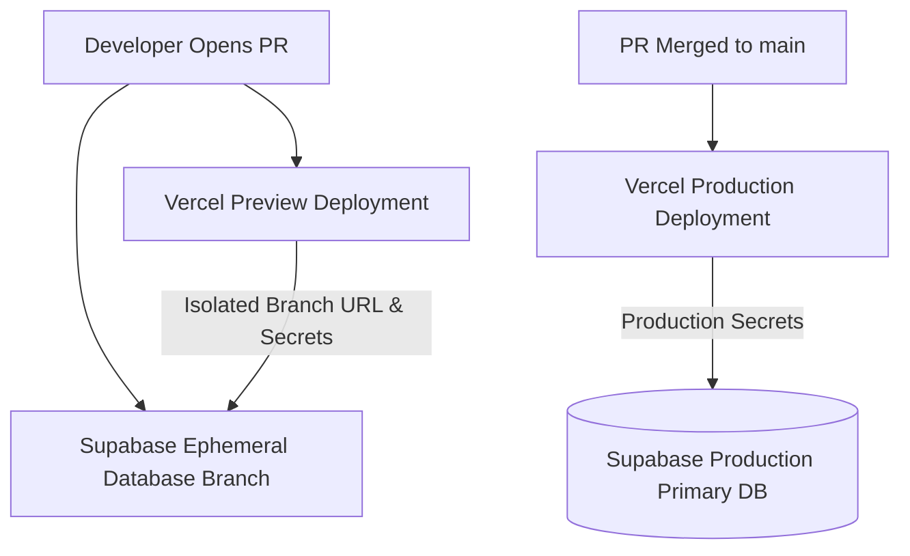

# InkFlow ERP — Vercel & Supabase Environment Isolation & Key Rotation Protocol

## 1. Environment Isolation Principle

> **INVARIANT:** Preview deployments generated from Pull Requests **MUST NEVER** connect to the Production Supabase Database or Production Payment/SMS Gateways.



---

## 2. Environment Matrix

| Variable | Development (Local) | Preview (Vercel PR) | Production (`main`) |
|---|---|---|---|
| `NEXT_PUBLIC_APP_URL` | `http://localhost:3000` | `https://[pr-hash].inkflowerp.com` | `https://app.inkflowerp.com` |
| `NEXT_PUBLIC_ROOT_DOMAIN` | `localhost:3000` | `inkflow-preview.com` | `inkflowerp.com` |
| `NEXT_PUBLIC_SUPABASE_URL` | `http://127.0.0.1:54322` | Dedicated Supabase Branch URL | `https://[prod-ref].supabase.co` |
| `NEXT_PUBLIC_SUPABASE_ANON_KEY` | Local Anon Key | Branch Anon Key | Production Anon Key |
| `SUPABASE_SERVICE_ROLE_KEY` | Local Service Role Key | Branch Service Role Key | Production Service Role Key |
| `DATABASE_URL` | `postgresql://...localhost:54322/postgres` | Branch Pooler URL (Port 6543) | Prod Pooler URL (Port 6543) |
| `DIRECT_URL` | `postgresql://...localhost:54322/postgres` | Branch Direct URL (Port 5432) | Prod Direct URL (Port 5432) |
| `FINANCIAL_PERSISTENCE_MODE` | `production` (on local DB) | `production` (on branch DB) | `production` (Strict DB) |
| `BKASH_BASE_URL` | Sandbox | Sandbox | `https://tokenized.pay.bka.sh/v1.2.0-beta` |
| `SSLCOMMERZ_IS_SANDBOX` | `true` | `true` | `false` |
| `SENTRY_ENVIRONMENT` | `development` | `preview` | `production` |

---

## 3. Ephemeral Supabase Database Branching for PRs

### 3.1 Setup with Supabase GitHub Integration
1. In **Supabase Dashboard** $\to$ **Integrations** $\to$ **GitHub**, connect the `PrintERP` repository.
2. Enable **Database Branching**.
3. For every open PR, Supabase automatically provisions a lightweight PostgreSQL branch cloned from production schema with migrations applied.
4. Supabase sends the branch credentials (`SUPABASE_URL`, `SUPABASE_ANON_KEY`, `SUPABASE_SERVICE_ROLE_KEY`) to the corresponding Vercel Preview environment via the Vercel-Supabase Integration.
5. On PR merge or closure, the ephemeral branch is automatically destroyed.

---

## 4. Secret Key Rotation Runbook

If any secret key is suspected of being exposed or during scheduled quarterly credential hygiene:

### 4.1 Supabase Service Role Key & Anon Key Rotation
1. Navigate to **Supabase Dashboard** $\to$ **Project Settings** $\to$ **API**.
2. Under **JWT Secret**, select **Generate new JWT Secret** or generate a secondary Service Role Key.
3. Immediately update in Vercel:
   ```bash
   vercel env add SUPABASE_SERVICE_ROLE_KEY production
   vercel env add NEXT_PUBLIC_SUPABASE_ANON_KEY production
   ```
4. Trigger an immediate production deployment:
   ```bash
   vercel redeploy --prod
   ```
5. Confirm `/api/health` reports `healthy` status.
6. Revoke the previous Service Role Key in Supabase.

### 4.2 Database Direct & Pooler Password Rotation
1. Navigate to **Supabase Dashboard** $\to$ **Database** $\to$ **Database Password**.
2. Enter a new high-entropy password ($\ge 32$ characters).
3. Update `DATABASE_URL` (Port 6543) and `DIRECT_URL` (Port 5432) in Vercel Environment Variables.
4. Promote/redeploy production.

### 4.3 Third-Party Payment & Communication Gateways
- **bKash & Nagad:** Rotate App Secret / Private Key in respective merchant portals, update `BKASH_APP_SECRET` and `NAGAD_MERCHANT_PRIVATE_KEY` in Vercel.
- **Greenweb & SMS BD:** Regenerate API token in provider dashboard and update `GREENWEB_SMS_TOKEN`.
- **Google OAuth Client Secret:** Rotate in Google Cloud Console Credentials page, update `GOOGLE_CLIENT_SECRET`.
