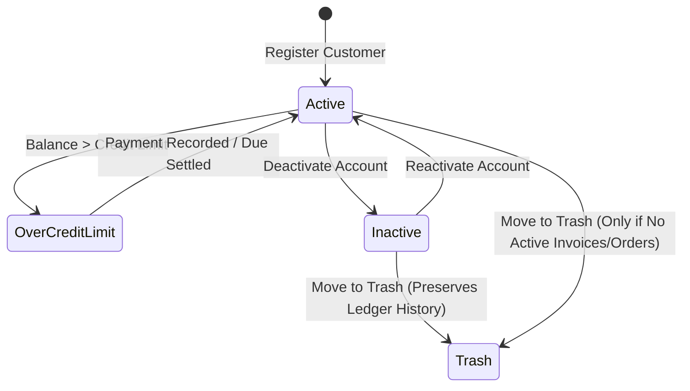

# UX Specification: Customers & CRM Module (গ্রাহক খতিয়ান ও কাস্টমার ডিরেক্টরি)

## 1. Executive Summary & Purpose
The Customers & CRM module is PrintFlow's client relationship and ledger management hub. Its primary job to be done (JTBD) is helping business owners, account executives, and collection managers answer:
> **"Which clients hold outstanding balances or exceed credit limits, and what is each client's live ledger & custom pricing tier?"**

The core customer workflow must be completable in **$\le 3$ clicks from the Dashboard**:
1. **Click 1:** Dashboard Quick Action: "+ New Customer" or "Customers" menu item.
2. **Click 2:** Fill Customer Info (Name, Mobile, Category/Tier, Credit Limit).
3. **Click 3:** Submit & Open Customer 360° Profile / Instant Create Quotation or Invoice.

---

## 2. Information Hierarchy & First Screen
The first screen strictly answers **"What needs my attention now?"**:

### A. Canonical 4-KPI Row (Fixed Height, Tabular BDT Numbers)
1. **Total Customers (মোট গ্রাহক):** Total registered accounts with category distribution.
2. **Active Accounts (সক্রিয় গ্রাহক):** Operational accounts with recent transaction activity.
3. **Accounts with Due (বকেয়া বিশিষ্ট গ্রাহক):** Customers currently carrying an unpaid receivable balance.
4. **Total Due Balance (মোট বকেয়া পাওনা):** Authoritative aggregate open receivables across all accounts.

### B. Prioritized Work List ("Needs Your Attention Now")
A prioritized queue rendering high-risk or high-attention customer accounts:
- Customers with highest overdue balances or balances exceeding their sanctioned credit limits.
- Inactive accounts carrying uncollected receivables.
- 1-Click Action buttons: **"Collect Due"** (opens instant payment modal), **"WhatsApp Due Reminder"**, **"Customer 360°"**.

### C. Unified Customer Directory
- Search across Name, Bengali Name, Company, Mobile, WhatsApp, Area, Customer Code, and ID No.
- Type filter (`Retail`, `Reseller`, `Corporate`, `Agency`, `Government`).
- Due status filter (`All`, `Has Outstanding Due`, `No Due / Settled`).
- Sort presets (`Newest`, `Highest Billed`, `Highest Due`, `Latest Order`, `Alphabetical`).
- Desktop tabular view with sticky headers, mobile touch cards below $768\text{px}$.

---

## 3. List Page Architecture & Filtering
1. **URL-Synced Filter State:**
   - Search Query (`?q=...`): Live search debounced with URL sync.
   - Category / Type (`?type=...`): `all`, `retail`, `reseller`, `corporate`, `agency`, `government`.
   - Due Filter (`?due=...`): `all`, `has_due`, `no_due`.
   - Sort Preset (`?sort=...`): `newest`, `highest_billed`, `highest_due`, `latest_order`, `alphabetical`.
2. **Responsive Table & Mobile Cards:**
   - Sticky header, tabular numbers, BDT currency symbol with Indian grouping (`৳ 1,25,000`).
   - Breakpoint $< 768\text{px}$ transforms table into touch cards with $\ge 44\text{px}$ actions and direct call/WhatsApp buttons.
3. **Empty States:**
   - Informative empty states with direct primary action button: *"+ Create First Customer"*.

---

## 4. Form Design & Customer Lifecycle
- **Sectioned Layout in `NewCustomerModal` & Edit Profile:**
  1. Primary Identity (Name, Bengali Name, Customer Code, Company).
  2. Contact & Communications (Mobile, WhatsApp, Email, Area, Address).
  3. Commercial Profile (Customer Category, Sanctioned Credit Limit in BDT).
  4. Internal Ledger Notes.
- **Safety Invariants:**
  - Phone number validation supporting Bangladesh prefixes (`013-019`).
  - Credit limit enforcement warnings when invoices exceed sanctioned terms.
  - Submit button disabled while submitting with progress spinner.
  - Immediate optimistic local update + database synchronization.

---

## 5. Status Workflow & Valid Transitions

- **Guaranteed Invariants:**
  - Customers with active un-cancelled invoices or pending production orders cannot be permanently purged; their records are safely archived with ledger immutability.
  - Transactions always maintain referential customer integrity.

---

## 6. Money, Dates & Localization
- **Currency:** Tabular BDT numbers with standard Bangladeshi formatting (`৳ 45,000`).
- **Dates & Timezone:** Relative activity markers ("Last order 2 days ago", "সক্রিয় হিসাব") with absolute date/time tooltip in `Asia/Dhaka` (UTC+6).
- **Languages:** Full parity across English (`en`) and Bengali (`bn`).

---

## 7. Resilience & Error Boundaries
- `loading.tsx`: 4-KPI cards + attention queue + table skeleton ensuring 0 CLS.
- `error.tsx`: Scoped error boundary with retry and request ID digest.
- `not-found.tsx`: Clean 404 message for non-existent customer profiles with redirect back to directory.
- `[id]` Detail Route: Dedicated `loading.tsx`, `error.tsx`, and `not-found.tsx`.

---

## 8. Verification Matrix
- **UI Audit:** 0 raw palette classes, 0 raw white/black tokens, $\ge 12\text{px}$ typography.
- **Playwright Flow Test:** Complete lifecycle (Create Customer $\to$ Edit Contact & Credit Limit $\to$ View Financial Summary & Ledger $\to$ Print Customer Statement) in EN/BN, Light/Dark, Mobile/Desktop.
