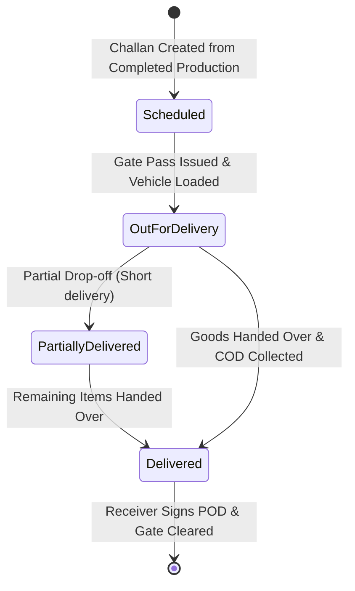

# UX Specification: Delivery & Finishing Module (ডেলিভারি চালান, অন-সাইট ফিটিং ও পোস্ট-প্রেস ফিনিশিং)

## 1. Executive Summary & Purpose
The Delivery & Finishing module represents the final operational fulfillment and customer handover phase in PrintFlow. Its primary job to be done (JTBD) is helping logistics coordinators, dispatch gatekeepers, signage installation supervisors, and post-press finishing technicians answer:
> **"Which orders are ready on the finishing bench to be laminated or bound, which consignments must be loaded onto vehicles today, how much Cash on Delivery (COD) must drivers collect before handover, and which field rigging crews need sign-off at customer sites?"**

The fulfillment and delivery handover workflow must be completable in **$\le 3$ clicks from the Dashboard**:
1. **Click 1:** Dashboard Quick Action: "Delivery Challan" or "Finishing Floor".
2. **Click 2:** Select Challan / Production Item $\to$ Assign Vehicle / Crew / Bench.
3. **Click 3:** Gate Pass Release / Collect COD / Confirm POD Signature.

---

## 2. Information Hierarchy & First Screen
The first screen strictly answers **"What needs my attention now?"**:

### A. Canonical 4-KPI Row for Delivery & Logistics (`/delivery`)
1. **Scheduled Today (আজকের ডেলিভারি):** Consignments scheduled for dock release and vehicle departure today.
2. **In Transit & Rigging (চলমান ট্রানজিট ও ফিটিং):** Combined count of delivery vehicles/couriers actively on roads plus active on-site signage rigging crews.
3. **Pending COD Collection (বকেয়া ক্যাশ অন ডেলিভারি):** Outstanding cash on delivery balance in BDT (`৳`) across all dispatched challans requiring collection prior to unloading.
4. **Delivered & Signed (সম্পূর্ণ ডেলিভারি ও রিসিভড):** Finished consignments with confirmed receiver signature or digital Proof of Delivery (POD).

### B. Canonical 4-KPI Row for Finishing & Post-Press (`/finishing`)
1. **Total Active Tasks (মোট ফিনিশিং কাজ):** All active jobs currently on post-press work orders across the plant.
2. **Digital Wide Finishing (ডিজিটাল ফিনিশিং ও লেমিনেশন):** Roll trimming, thermal lamination, grommet eyeleting, and banner edge welding.
3. **Offset Post-Press & Binding (অফসেট ও বাইন্ডিং):** Polar paper cutting, folding, saddle stitching, hard-cover binding, and die-punching.
4. **Signage & Acrylic Fab (সাইনেজ ও ৩ডি এক্রিলিক):** CNC router cutting, channel letter bending, LED module wiring, and neon flex fabrication.

### C. Prioritized Attention Queue ("Needs Your Attention Now")
A prioritized queue rendering urgent logistics and post-press bottlenecks:
- **Dock Gate Release Pending:** Orders ready from finishing with scheduled delivery date = today, with 1-click **"Gate Pass & Out for Delivery"**.
- **Urgent COD Collection Warnings:** Dispatched consignments with high due balances (`due_amount > 0`), with 1-click **"Collect COD"** and **"WhatsApp Delivery Notice"**.
- **Active On-Site Signage Rigging:** Field crews installing large outdoor boards/LED signs, with 1-click **"Mark Completed & Signed"**.
- **Finishing Bench Bottlenecks:** High-priority print jobs awaiting lamination or die-cutting before delivery promises are missed, with 1-click **"Start Bench Task"**.
- **All-Clear State:** Calming verification badge when all dispatches are on schedule and all delivered balances are settled.

---

## 3. Detail Views & Workspaces
### A. Delivery Challan Detail (`/delivery/[id]`)
- Two-column responsive desktop layout (Challan particulars, client destination, driver info, and line items on left; Multi-copy print selector, COD financial ledger, and digital Proof of Delivery signature on right).
- **Bangladeshi Triplicate Printing Protocol:**
  - *Copy 1 (গ্রাহক কপি):* Customer Acknowledgment Copy with itemized breakdown and receiver signature block.
  - *Copy 2 (গেট পাস ও ট্রান্সপোর্ট কপি):* Factory Gate & Vehicle Transit Check Copy with driver phone and vehicle registration number.
  - *Copy 3 (অফিস ও হিসাব কপি):* Accounts & Due Collection Verification Copy showing gross total, advance paid, and net COD due.
- **WhatsApp Dispatch Dispatcher:** 1-click automated Bangla/English delivery manifest message with tracking phone and due amounts.

### B. Finishing & Fabrication Floor (`/finishing`)
- Departmental station filter tabs (All, Digital Wide, Offset Binding, Signage Fab, QC Inspection).
- High-visibility touch-friendly timer controls (Start Bench, Pause, Complete, Hold) for floor operators.
- Automated defect logging with predefined fault classifications (misprint, registration off, lamination bubble, tear).
- Seamless handoff to delivery dispatch upon QC verification.

---

## 4. Status Workflow & Valid Transitions

---

## 5. Acceptance Criteria & Test Verification
1. **Information Design:** 4-KPI canonical grid and Prioritized Attention Queue visible on first screen above fold.
2. **Speed-to-Action:** Vehicle gate release and COD collection executed in $\le 3$ clicks.
3. **Bangladeshi Logistics Standards:** Triplicate challan printing (Customer, Gate Pass, Office), BDT currency formatting, and WhatsApp dispatch messaging.
4. **Resilience Boundaries:** Dedicated `loading.tsx`, `error.tsx` (with digest and retry), and `not-found.tsx` for `/delivery`, `/delivery/[id]`, and `/finishing`.
5. **Quality Gates:** 0 errors on `npm run typecheck`, 0 violations on `npm run ui-audit`.
