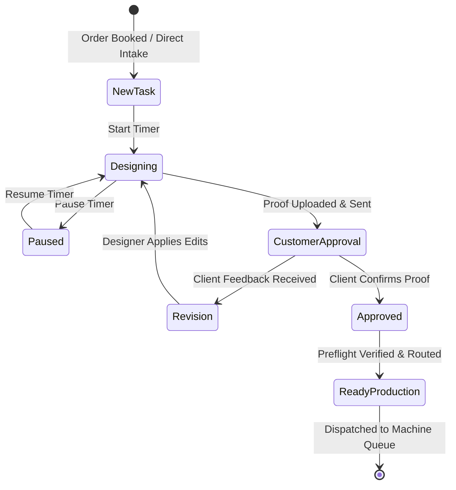

# UX Specification: Design Studio & Designer Workbench Module (ডিজাইন স্টুডিও ও প্রাক-মুদ্রণ প্রিফ্লাইট)

## 1. Executive Summary & Purpose
The Design Studio & Designer Workbench module is PrintFlow's creative intake and prepress gateway. Its primary job to be done (JTBD) is helping studio art directors, graphic designers, and prepress operators answer:
> **"Which customer proofs are pending client approval, which jobs have revision requests, and what artwork is preflight-cleared for the printing press?"**

The core design & approval workflow must be completable in **$\le 3$ clicks from the Dashboard**:
1. **Click 1:** Dashboard Quick Action: "Design Studio" or Work Order item.
2. **Click 2:** Start Design Timer / Upload Proof Asset.
3. **Click 3:** Send WhatsApp Proof or Approve & Route to Printing Press (`/production`).

---

## 2. Information Hierarchy & First Screen
The first screen strictly answers **"What needs my attention now?"**:

### A. Canonical 4-KPI Row (Fixed Height, Tabular Numbers)
1. **Active Design Jobs (মোট সক্রিয় ডিজাইন):** Total creative tasks across new intake, in-draft, and pending proofing.
2. **In Progress / Designing (ডিজাইনিং চলমান):** Jobs currently opened on designer workstations with running billable timers.
3. **Waiting Approval (অনুমোদনের অপেক্ষায়):** Proofs sent to clients via WhatsApp/Email awaiting confirmation.
4. **Needs Revision / Attention (সংশোধন ও জরুরি কাজ):** Client-requested revisions, overdue proof reviews (>24h), or rush walk-in designs.

### B. Prioritized Work List ("Needs Your Attention Now")
A prioritized queue rendering creative tasks requiring immediate action:
- Jobs with client revision feedback ("Correction Requested").
- Customer proofs awaiting approval for more than 24 hours.
- Rush designs with same-day print deadlines.
- 1-Click Action buttons: **"Start / Resume"**, **"WhatsApp Proof"**, **"Preflight & Route to Press"**.

### C. Unified Studio Workspaces
- **Invoice Group Accordions:** Consolidated customer invoice card grouping multiple artwork items (e.g. Banner + Business Cards + Hangtags) together to prevent fragmented studio duplicate tickets.
- **Table View:** Dense prepress list with preflight resolution status (300 DPI, CMYK color mode, Bleed/Trim margin check).

---

## 3. Designer Workbench (`/designer`)
Focused, distraction-free interface for production artists:
- Single active job hero card with live duration stopwatch.
- Direct asset drag-and-drop versioning (V1, V2, Final Print Ready).
- Built-in Preflight Validator: Resolution, Color Space, Font Outlines, and Cut-Contour Spot Colors.
- One-Click WhatsApp Proof dispatcher with pre-filled Bangladeshi greetings.

---

## 4. Status Workflow & Valid Transitions

- **Guaranteed Invariants:**
  - Files missing bleed margins or in RGB color mode trigger preflight warnings before routing to offset or digital press.
  - Duration is automatically tracked to allow accurate hourly graphic design cost recovery.

---

## 5. Localization, Money & Dates
- **Hourly Creative Charges:** Right-aligned tabular BDT numbers (`৳ 500/hr`).
- **Dates & Timezone:** Relative indicators ("Proof sent 3 hours ago", "Due today at 4 PM") with absolute `Asia/Dhaka` tooltips.
- **Bilingual Support:** Complete English and Bengali parity (e.g. প্রিফ্লাইট যাচাই, প্রুফ অনুমোদন, ক্লায়েন্ট সংশোধন, প্রেস রুট).

---

## 6. Resilience & Route Boundaries
- `loading.tsx`: 4-KPI cards + attention queue + studio tabs skeleton ensuring 0 CLS.
- `error.tsx`: Scoped error boundary with retry and request ID digest.
- `not-found.tsx`: Scoped 404 boundary for non-existent design job numbers.
- Unified boundaries across `/design`, `/design/[id]`, and `/designer`.

---

## 7. Verification Matrix
- **UI Audit:** 0 raw palette classes, 0 raw white/black tokens, $\ge 12\text{px}$ typography.
- **Playwright Flow Test:** Complete lifecycle (Start Design $\to$ Upload Proof $\to$ WhatsApp Proof $\to$ Approve & Route to Press) in EN/BN, Light/Dark, Mobile/Desktop.
