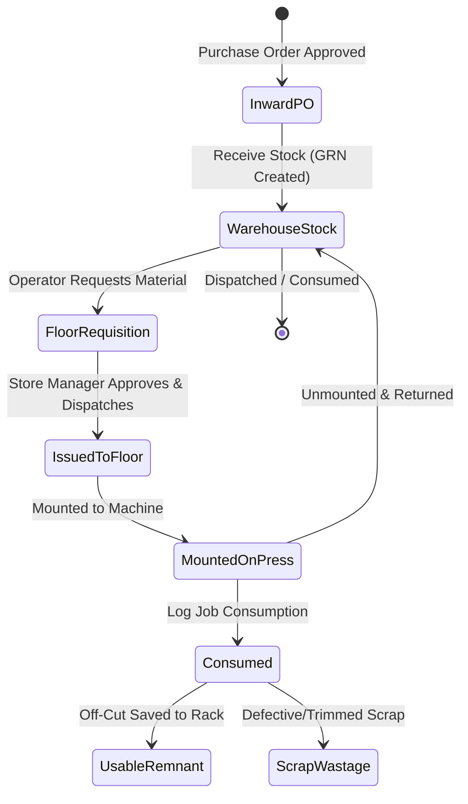

# UX Specification: Inventory & Floor Consumption Module (ইনভেন্টরি ও প্রেস ফ্লোর কনজাম্পশন)

## 1. Executive Summary & Purpose
The Inventory & Floor Consumption module is InkFlow ERP's physical asset accounting and press-floor material tracking engine. Its primary job to be done (JTBD) is helping inventory store managers, warehouse keepers, and press floor supervisors answer:
> **"Which substrates or media rolls are critically low or depleted, what operator requisitions are waiting to be issued to the floor, and how much substrate was consumed or wasted during today's print runs?"**

The core inventory replenishment and floor issue workflows must be completable in **$\le 3$ clicks from the Dashboard**:
1. **Click 1:** Dashboard Quick Action: "Inventory Hub" or "Floor Consumption".
2. **Click 2:** "Create PO / Reorder" or "Direct Issue Roll to Press" or "Log Consumption".
3. **Click 3:** Confirm Quantity & Location / Save Stock Movement / Print Receipt.

---

## 2. Information Hierarchy & First Screen
The first screen strictly answers **"What needs my attention now?"**:

### A. Canonical 4-KPI Row (Fixed Height, Tabular Numbers)
1. **Total Stock Valuation (মোট স্টক মূল্য):** Total warehouse balance formatted with `৳` and lakh/crore grouping, displaying materials and finished goods breakdown.
2. **Critical Shortages (স্টক ঘাটতি ও সতর্কতা):** Real-time count of out-of-stock items and substrates below minimum reorder thresholds.
3. **Active Media Rolls (সক্রিয় মিডিয়া রোল):** Warehouse master rolls and active rolls currently mounted on press machines.
4. **Pending Inward GRN (পেন্ডিং ইনওয়ার্ড POs):** Purchase orders awaiting physical dock receipt, QC inspection, and GRN entry.

### B. Prioritized Work List / Attention Queue ("Needs Your Attention Now")
A prioritized queue rendering urgent operational items requiring immediate action:
- **Critical Stock Shortages:** Substrates at zero stock or below safety reorder level with a 1-click **"Reorder / Create PO"** shortcut.
- **Pending Floor Requisitions:** Press operator requests waiting for warehouse dispatch with 1-click **"Approve & Issue"**.
- **Pending Inward POs:** Approved vendor shipments awaiting warehouse check-in with 1-click **"Receive Stock (GRN)"**.
- **Low-Length Mounted Rolls:** Rolls on press machines with $< 20\text{ ft}$ remaining, alerting operators before print disruption.
- When no shortages or pending approvals exist, displays a clean, calming confirmation banner: *"All inventory thresholds healthy — no critical shortages or pending approvals."*

### C. Unified Inventory Workspaces
- **Substrates & Raw Materials:** Dense catalog grouped by canonical 7-attribute inventory specification (Substrate Type, Width ft, Length ft, Allowance ft, Unit Cost, GSM, Finishing).
- **Physical Media Rolls:** Serialized barcode roll rack with machine mounting telemetry (mounted on machine vs in-warehouse).
- **Press Floor Consumption Station (`/production/floor-consumption`):** Dedicated workstation interface for press operators to log job-linked linear/square-foot consumption, off-cuts, and scrap.
- **Stock Ledger & Audit Trail (`/inventory/ledger`):** Tamper-evident ledger detailing every GRN receipt, floor issue, scrap loss, and manual audit adjustment.

---

## 3. Press Floor Consumption Station (`/production/floor-consumption`)
Tailored for the physical shop floor environment with high tactile usability:
- **Live Mounted Rolls HUD:** Clear visualization of rolls currently spinning on wide-format and digital presses, with remaining length percentages and warning thresholds.
- **Job-Linked Consumption Logger:** Operators select the running Production Task / Work Order, enter used linear feet or sheet count, and record generated off-cuts or unusable scrap.
- **Usable Remnants Generator:** Automatically generates serialized off-cut remnants with length $\times$ width measurements to be saved for subsequent smaller print jobs.
- **One-Touch Material Requisition:** Fast mobile/tablet button allowing machine operators to request raw materials from the central warehouse without leaving the press.

---

## 4. Status Workflow & Valid Stock Transitions

- **Guaranteed Invariants:**
  - Issuing a roll to the floor automatically updates warehouse balance and creates an immutable stock ledger audit record.
  - Consumed square footage or sheet count updates live job cost accounting in Production.
  - Zero raw palette classes, zero unapproved color glows, and zero raw `text-white`/`bg-black`.

---

## 5. Bangladeshi Printing Industry Context & Localization
- **Printing Substrate Units:**
  - রিম (Ream - 500 sheets for paper/art card)
  - রোল (Roll - wide format flex, vinyl, mesh, banner)
  - পাতা / শিট (Sheets - offset paper, board, sticker)
  - বর্গফুট (SFT - square feet for digital print charging)
  - গজ (Yards) & মিটার (Meters)
  - কেজি (KG - ink, chemical, binding wire)
  - লিটার (Liters - solvent, eco-solvent, UV ink)
- **Currency & Numerals:**
  - Tabular right-aligned currency with BDT (`৳`) symbol and Bangladeshi lakh/crore formatting (`৳ ১,৫০,০০০.০০`).
  - Dual calendar support (Gregorian + Bangla calendar) and Asia/Dhaka (UTC+6) relative timestamps.

---

## 6. Resilience, Route Boundaries & Error Handling
- **Route Boundaries:**
  - `app/[tenantSlug]/inventory/loading.tsx`, `error.tsx`, `not-found.tsx`
  - `app/[tenantSlug]/inventory/[id]/loading.tsx`, `error.tsx`, `not-found.tsx`
  - `app/[tenantSlug]/production/floor-consumption/loading.tsx`, `error.tsx`, `not-found.tsx`
- **Error Boundaries:** Friendly error card displaying actionable error context, Request ID digest for technical support, and an immediate **"Retry"** button.
- **Data Persistence:** Optimistic UI updates with rollback on network failure, keeping offline drafts in localStorage.

---

## 7. Acceptance Criteria & Verification Gate
1. **Canonical 4-KPI Row:** Displays Stock Value, Critical Shortages, Active Rolls, and Pending Inward GRN.
2. **Prioritized Attention Queue:** Surfaces urgent stock deficits and pending operator requisitions with 1-click actions.
3. **Floor Consumption Flow:** Allows logging linear feet or sheet consumption against a job with off-cut remnant tracking.
4. **Mobile & Tablet Touch-Ready:** Touch targets $\ge 44\text{px}$, responsive single-column layout on $< 768\text{px}$.
5. **Bilingual Parity:** 100% translation coverage between English and Bengali across all inventory tables and modals.
6. **Zero Violations:** Passes `npm run ui-audit` (0 violations) and `npm run typecheck` (0 errors).
