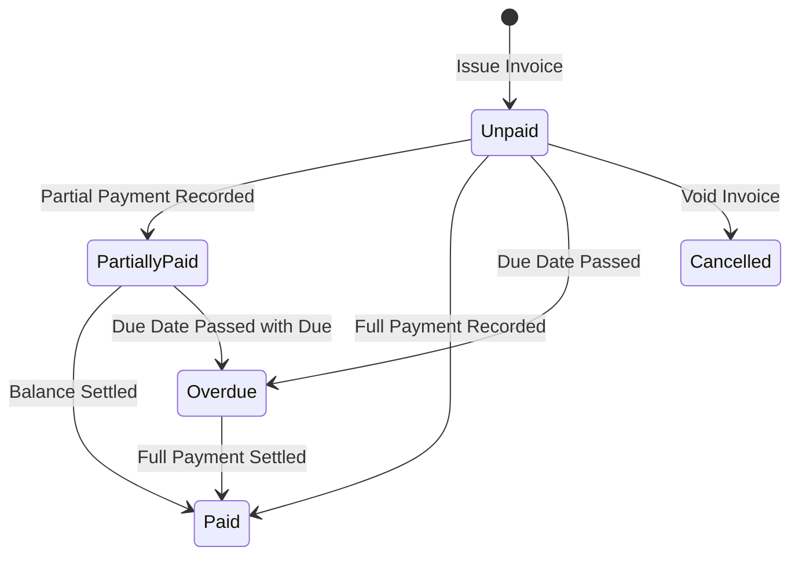

# UX Specification: Invoices & Billing Module (বিলিং, চালান ও বকেয়া কালেকশন)

## 1. Executive Summary & Purpose
The Invoices & Billing module is InkFlow ERP's financial nerve center. Its primary job to be done (JTBD) is helping the business owner, accountant, and collection managers answer:
> **"Which customer bills are overdue for collection today, and what is our live cash vs receivable status?"**

The main billing workflow must be completable in **$\le 3$ clicks from the Dashboard**:
1. **Click 1:** Dashboard Quick Action: "Record Payment" / "Collect Due" or "+ New Work".
2. **Click 2:** Select Customer & Invoice / Enter Payment details (Cash, bKash, Bank).
3. **Click 3:** Confirm Payment & Print Money Receipt / Send WhatsApp voucher.

---

## 2. Information Hierarchy & First Screen
The first screen strictly answers **"What needs my attention now?"**:

### A. Canonical 4-KPI Row (Fixed Height, Tabular BDT Numbers)
1. **Total Invoiced (মোট চালান বিক্রয়):** Value and count of commercial & VAT invoices generated in selected period.
2. **Total Collected (মোট আদায়কৃত অর্থ):** Cash, MFS, and bank collections received with collection efficiency rate %.
3. **Outstanding Dues (চলতি বকেয়া পাওনা):** Open customer receivable balances pending collection.
4. **Critical Overdue (মেয়াদোত্তীর্ণ বকেয়া):** Bills exceeding credit terms needing immediate payment recovery.

### B. Prioritized Work List ("Needs Your Attention Now")
A prioritized collections queue rendering overdue accounts:
- Highest outstanding overdue customer accounts ($> ৳ 25,000$, $> 15$ days overdue).
- Pending invoice generation requests from shop floor operators.
- 1-Click Action buttons: **"Collect Due"**, **"WhatsApp Reminder"**, **"View Invoice"**.

### C. Unified Financial Workspace
- Tabs: **Invoices** (master list), **Invoice Requests** (shop floor intake queue), **Payments** (money receipts), **Customer Dues** (customer ledger breakdown).
- Table view on desktop, responsive touch cards on mobile ($< 768\text{px}$).

---

## 3. List Page Architecture & Filtering
1. **URL-Synced Filter State:**
   - Search Query (`?q=...`): Invoice #, Customer name, Phone, BIN, Order #.
   - Status Filter (`?status=...`): `all`, `unpaid`, `partially_paid`, `paid`, `overdue`, `vat`, `cancelled`.
   - Date Period (`?period=...`): `today`, `this_week`, `this_month`, `all_time`, `custom`.
   - Module Tab (`?tab=...`): `invoices`, `requests`, `payments`, `receivables`.
2. **Responsive Table & Mobile Cards:**
   - Sticky header, tabular numbers, BDT currency symbol with Indian grouping (`৳ 1,25,000`).
   - Breakpoint $< 768\text{px}$ transforms table into touch cards with $\ge 44\text{px}$ actions.
3. **Empty States:**
   - Informative empty states with direct primary action button: *"+ Create New Invoice"*.

---

## 4. Form Design & Invoicing Engine
- **Sectioned Layout in `NewInvoiceModal`:**
  1. Customer Info & Tax/BIN configuration.
  2. Order / Job selection or Custom Billing Items.
  3. Pricing, Discount, AIT (Advance Income Tax), and VAT (Mushak 6.3 standard: 0%, 5%, 7.5%, 15%).
  4. Payment Terms & Due Date.
- **Safety Invariants:**
  - Auto-drafting guards against accidental navigation.
  - Submit button disabled while submitting with spinner.
  - Generates instant Money Receipt when payment is recorded.

---

## 5. Status Workflow & Valid Transitions

- **Guaranteed Invariant:** Fully paid invoices cannot be cancelled without supervisor refund authorization.

---

## 6. Money, Dates & Localization
- **Currency:** Tabular BDT numbers with standard Bangladeshi formatting (`৳ 45,000`).
- **Dates & Timezone:** Relative aging ("Due today", "15 days overdue", "আজকের তৈরি") with absolute date/time tooltip in `Asia/Dhaka` (UTC+6).
- **Languages:** Full parity across English (`en`) and Bengali (`bn`).

---

## 7. Resilience & Error Boundaries
- `loading.tsx`: 4-KPI cards + attention queue + table skeleton ensuring 0 CLS.
- `error.tsx`: Scoped error boundary with retry and request digest.
- `not-found.tsx`: Clean 404 message for non-existent invoice records.

---

## 8. Verification Matrix
- **UI Audit:** 0 raw palette classes, 0 raw white/black tokens, $\ge 12\text{px}$ typography.
- **Playwright Flow Test:** Full lifecycle (Create Invoice $\to$ Record Payment $\to$ Status Transition to Paid $\to$ Print Money Receipt & Tax Invoice) in EN/BN, Light/Dark, Mobile/Desktop.
