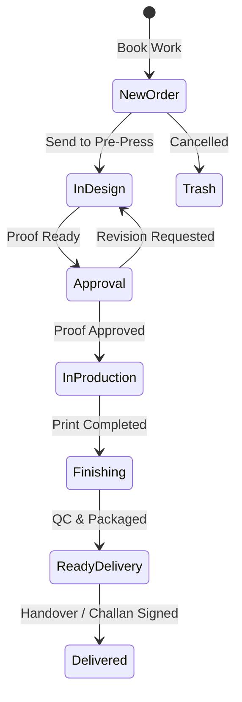

# UX Specification: Orders & Sales Module (অর্ডার, বিক্রয় ও জব ট্র্যাকিং)

## 1. Executive Summary & Purpose
The Orders & Sales module is the operational engine of InkFlow ERP. Its core job to be done (JTBD) is helping press owners, production managers, and customer service staff answer:
> **"What jobs are blocked or scheduled for delivery today, and what press operations need immediate intervention?"**

The main workflow must be completable in **$\le 3$ clicks from the Dashboard**:
1. **Click 1:** Dashboard Quick Action: "+ New Work" (or "+ নতুন কাজ").
2. **Click 2:** Select Customer & Specify Line Item / Product in `NewWorkWizard`.
3. **Click 3:** Confirm Booking & Route to Production / Print Job Ticket.

---

## 2. Information Hierarchy & First Screen
The first screen strictly answers **"What needs my attention now?"**:

### A. Canonical 4-KPI Row (Fixed Height, Tabular Numbers)
1. **Active Booked Orders (চলতি মোট অর্ডার):** Total active orders in pipeline with total value in BDT.
2. **In Production & Press (প্রেসে চলমান কাজ):** Live printing and fabrication jobs currently on machines.
3. **Ready for Delivery (ডেলিভারি প্রস্তুত):** Finished jobs awaiting customer pickup or delivery van dispatch.
4. **Needs Attention (জরুরি মনোযোগ প্রয়োজন):** Count of blocked jobs (missing paper/plates), proofs awaiting client approval, and overdue deliveries.

### B. Prioritized Work List ("Needs Your Attention Now")
A prominent, action-oriented attention queue rendering critical orders:
- **Blocked Jobs:** Missing raw materials, plates, or customer artwork.
- **Client Approval Pending:** Proofs sent via WhatsApp awaiting client sign-off.
- **Overdue Deliveries:** Jobs whose scheduled delivery time has passed.
- **1-Click Actions:** "Resolve Blocker", "Send WhatsApp Reminder", "Advance Stage".

### C. Master Workflow Directory & Board
Unified orders view supporting stage tabs (All, Needs Attention, Design, Approval, Production, Finishing, Ready, Delivery, Delivered) with table view on desktop and card view on mobile.

---

## 3. List Page Architecture & Filtering
1. **URL-Synced Filter State:**
   - Search Query (`?q=...`): Order #, Job #, Customer, Phone, Invoice #, Item, Operator, Machine.
   - Stage Filter (`?stage=...`): `all`, `needs_attention`, `design`, `approval`, `production`, `finishing`, `ready`, `delivered`.
   - Priority Filter (`?priority=...`): `all`, `urgent`, `very_urgent`, `normal`.
   - Quick Filter (`?quick=...`): `due_today`, `blocked`, `overdue`, `payment_due`.
2. **Table & Mobile Switch:**
   - Desktop ($\ge 768\text{px}$): Sticky header, columns for Order #, Customer, Job Specifications, Total & Advance (BDT), Live Status, Progress Stepper, Actions.
   - Mobile ($< 768\text{px}$): Touch cards with status badges, action buttons ($\ge 44\text{px}$ touch targets), and swipeable quick actions.
3. **Empty States:**
   - Contextual empty states with clear call-to-action button: *"+ Book New Work"*.

---

## 4. Form Design & Order Intake Engine
- **Sectioned Layout in `NewWorkWizard`:**
  1. Customer Info (Existing search or Walk-in rapid entry).
  2. Order Specifications (Product selection or zero-catalog custom dimensions: W × H, SQFT/Quantity).
  3. Machine & Finishing Routing (Press assignment, lamination, die-cutting, eyelets).
  4. Advance Payment & Invoice Generation (Cash, bKash, Bank with automatic receipt).
- **Safety Invariants:**
  - Auto-drafting prevents data loss on interrupted intake.
  - Submit button disabled while submitting with spinner.
  - Success notification provides 1-click links to Job Ticket & Invoice.

---

## 5. Status Workflow & Valid Transitions

- **Guaranteed Invariant:** Stage advancement validates preconditions (e.g. proof must be approved before printing starts; advance payment logged before release).

---

## 6. Money, Dates & Localization
- **Currency:** Tabular BDT numbers with standard Bangladeshi formatting (`৳ 45,000`).
- **Dates & Timezone:** Relative delivery deadlines ("Due in 2 hours", "আজ বিকাল ৫:০০") with absolute tooltip in `Asia/Dhaka` (UTC+6).
- **Languages:** Full parity across English (`en`) and Bengali (`bn`).

---

## 7. Resilience & Error Boundaries
- `loading.tsx`: 4-KPI cards + attention queue + table skeleton ensuring 0 CLS.
- `error.tsx`: Scoped error boundary with retry and request digest.
- `not-found.tsx`: Clean 404 message for non-existent order numbers.

---

## 8. Verification Matrix
- **UI Audit:** 0 raw palette classes, 0 raw white/black tokens, $\ge 12\text{px}$ typography.
- **Playwright Flow Test:** Full lifecycle (Create $\to$ Edit $\to$ Advance Stage $\to$ Print Job Ticket) in EN/BN, Light/Dark, Mobile/Desktop.
