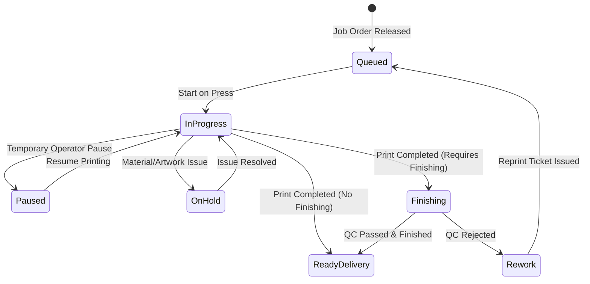

# UX Specification: Production Floor & Operator Kiosk Module (প্রোডাকশন ফ্লোর ও অপারেটর প্যানেল)

## 1. Executive Summary & Purpose
The Production Floor & Operator module is InkFlow ERP's physical manufacturing engine. Its primary job to be done (JTBD) is helping the factory manager, press operators, and finishing leads answer:
> **"Which jobs are currently running on machines, what is queued next, and what bottlenecks or material shortages need immediate intervention?"**

The core production execution workflow must be completable in **$\le 3$ clicks from the Dashboard**:
1. **Click 1:** Dashboard Quick Action: "Active Production" or Floor Task Queue.
2. **Click 2:** Select Job / Machine and Click "Start Production" (বা "মেশিনে চালু").
3. **Click 3:** Complete Task with Quantity/Waste & Print Job Ticket / Route to Finishing.

---

## 2. Information Hierarchy & First Screen
The first screen strictly answers **"What needs my attention now?"**:

### A. Canonical 4-KPI Row (Fixed Height, Tabular Numbers)
1. **In Production (চলমান উৎপাদন কাজ):** Total active printing and fabrication jobs across the facility.
2. **Running on Press (মেশিনে প্রিন্টিং):** Jobs actively printing right now with live machine allocation and timers.
3. **Finishing & QC (ফিনিশিং ও কোয়ালিটি):** Printed work undergoing cutting, lamination, eyeleting, binding, or inspection.
4. **Urgent & Bottlenecks (জরুরি ও সমস্যাগ্রস্ত):** Rush orders with today's deadline, halted tasks (lack of ink/substrate), or rework tasks.

### B. Prioritized Work List ("Needs Your Attention Now")
A prioritized queue rendering urgent floor interventions:
- Jobs marked "On Hold" due to missing raw materials, substrate mismatch, or artwork revision.
- Rush jobs promised for delivery today that haven't commenced on press.
- Machines with reported breakdowns or pending maintenance.
- 1-Click Action buttons: **"Start / Resume"**, **"Resolve Issue"**, **"Job Ticket & QR"**.

### C. Unified Floor Views
- **Consolidated Job Cards:** Single unified job card displaying multi-stage progression (Printing $\to$ Lamination $\to$ Cutting $\to$ Packing) rather than fragmented duplicate tickets.
- **Machine Queue View:** Live per-machine workload showing active job, queued jobs, and estimated runtime.
- **Table View:** Dense tabular format for floor supervisors with sticky headers and batch dispatching.

---

## 3. Mobile Operator Kiosk (`/operator`)
Designed mobile-first for factory operators wearing gloves or working one-handed beside heavy machinery:
- **Zero Distraction UI:** Large touch targets ($\ge 48\text{px}$) for Start, Pause, Hold, and Complete.
- **Live Floor Timer:** Elapsed run duration timer for accurate machine hour costing.
- **One-Handed Defect & Waste Logging:** Pre-populated common print defect chips (Banding, Color Shift, Wrinkles, Media Jam).
- **Fast Breakdown Reporting:** Quick incident reporter to alert maintenance and pause press queue instantly.

---

## 4. Status Workflow & Valid Transitions

- **Guaranteed Invariants:**
  - Tasks cannot be marked completed without recording produced quantity or confirming 0 defects.
  - A machine marked "Under Breakdown" cannot have new jobs started until cleared by maintenance.

---

## 5. Money, Dates & Localization
- **Machine Hourly Rates & Wastage:** Tabular BDT numbers with standard grouping (`৳ 1,200/hr`).
- **Dates & Timezone:** Relative aging ("Due in 2 hours", "Overdue by 45m") with absolute tooltip in `Asia/Dhaka` (UTC+6).
- **Languages:** Full parity across English (`en`) and Bengali (`bn`) with authentic press terms (যেমন: গ্রিপার মার্জিন, লেমিনেশন, আইলেট, মাউন্টিং, কাটিং).

---

## 6. Resilience & Error Boundaries
- `loading.tsx`: 4-KPI cards + attention queue + floor tabs skeleton ensuring 0 CLS.
- `error.tsx`: Scoped error boundary with retry and request ID digest.
- `not-found.tsx`: Scoped 404 boundary for non-existent job or task IDs.
- Dedicated boundaries across `/production`, `/production/[id]`, and `/operator`.

---

## 7. Verification Matrix
- **UI Audit:** 0 raw palette classes, 0 raw white/black tokens, $\ge 12\text{px}$ typography.
- **Playwright Flow Test:** Complete lifecycle (Start Task on Press $\to$ Pause / Log Defect $\to$ Complete & Route to Finishing $\to$ Print Job Ticket & QR) in EN/BN, Light/Dark, Mobile/Desktop.
