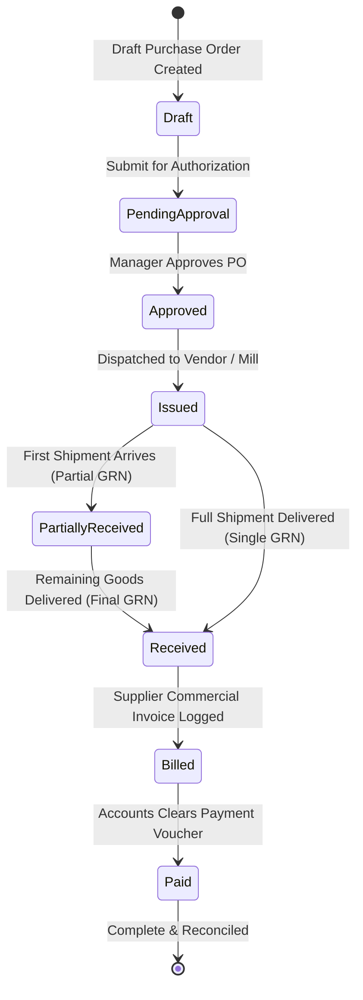

# UX Specification: Purchases & Suppliers Module (ক্রয় ব্যবস্থাপনা ও মহাজন ডিরেক্টরি)

## 1. Executive Summary & Purpose
The Purchases & Suppliers module is InkFlow ERP's supply chain procurement and vendor payable ledger system. Its primary job to be done (JTBD) is helping procurement officers, accounts executives, and production managers answer:
> **"Which purchase orders need approval or dockside GRN receiving, which suppliers have exceeded credit limits or have overdue payables, and where can we source raw substrates at the best agreed market rates?"**

The core purchasing & supplier settlement workflow must be completable in **$\le 3$ clicks from the Dashboard**:
1. **Click 1:** Dashboard Quick Action: "New Purchase PO" or "Supplier Directory".
2. **Click 2:** Select Vendor & Substrates / Enter Quantities & Challan No.
3. **Click 3:** Confirm Order / Receive GRN / Issue Payment Voucher.

---

## 2. Information Hierarchy & First Screen
The first screen strictly answers **"What needs my attention now?"**:

### A. Canonical 4-KPI Row for Suppliers (`/suppliers`)
1. **Total Suppliers & Partners (মোট সরবরাহকারী):** Total registered merchants, indicating active vendor relationships across Nayabazar, Chawkbazar, and Fakirapool.
2. **Total Outstanding Payable (মোট বকেয়া পাওনা):** Total financial debt owed to vendors formatted with `৳` and lakh/crore grouping, with vendor count pending payment.
3. **Credit Overdue / Warning (সীমা অতিক্রম ও জরুরি):** Suppliers whose outstanding balances exceed approved credit ceilings or terms.
4. **Agreed Contract Rates (নির্ধারিত চুক্তি দর):** Active catalog prices locked in with importers and paper mills.

### B. Canonical 4-KPI Row for Purchases (`/inventory?view=purchases` / `/purchases`)
1. **Total Purchase Spend (মোট ক্রয় ব্যয়):** Cumulative procurement commitments in BDT.
2. **Pending PO Approval (অনুমোদনের অপেক্ষায়):** Purchase requisitions awaiting manager authorization.
3. **Awaiting GRN Intake (পেন্ডিং ইনওয়ার্ড জিআরএন):** Issued POs awaiting physical delivery, gate check, and warehouse entry.
4. **Unpaid Invoices & Dues (বকেয়া চালান):** Received shipments awaiting payment voucher disbursement.

### C. Prioritized Work List / Attention Queue ("Needs Your Attention Now")
A prioritized queue rendering urgent supply-chain items:
- **Exceeded Credit Suppliers:** Vendors where `outstanding_balance > credit_limit`, with 1-click **"Pay Voucher"** and **"Contact Vendor"**.
- **Pending Dock Receipts:** Issued purchase orders with vendor shipments in transit with 1-click **"Receive Material (GRN)"**.
- **Pending Requisitions:** Departmental material requests requiring PO creation with 1-click **"Generate PO"**.
- **All-Healthy State:** Calming verification badge when all vendor accounts and deliveries are in balance.

---

## 3. Detail Views & Workspaces
### A. Purchase Order Detail (`/purchases/[id]`)
- Two-column desktop layout (Purchase specification & line items on left; Financial balance, GRN intake history, and payment vouchers on right).
- **Partial & Full GRN Receiving:** Records gate-pass challan numbers, inspected roll/sheet quantities, automatically updates warehouse stock balances and logs stock ledger movements.
- **Supplier Payment Voucher:** Logs cash, bank, cheque, or MFS payments with double-entry cash book recording.
- **Price Benchmarking Card:** Automatically compares supplier PO rate against historical 90-day wholesale market averages.

### B. Supplier Profile (`/suppliers/[id]`)
- Comprehensive Mahajon overview: Category badges (Flex Media Importer, Paper Mill, Ink Dealer, Acrylic Merchant, Hardware).
- Tabbed ledger: Contract rates, purchase orders, payment vouchers, immutable financial statement, and official trade license/BIN/TIN credentials.
- 1-click **"WhatsApp Statement"** and **"Print Mahajon Ledger"** shortcuts.

---

## 4. Status Workflow & Valid Transitions

---

## 5. Bangladeshi Market Context & Localization
- **Market Hubs:**
  - নয়াবাজার (Nayabazar - Paper & art card capital)
  - চকবাজার (Chawkbazar - Plastic, acrylic, and hardware)
  - ফকিরারপুল (Fakirapool - Digital printing supplies and trade finishing)
  - আরামবাগ (Arambagh - Printing press district)
  - বাংলাবাজার (Banglabazar - Book publishing & offset paper)
- **Local Payment Practices:**
  - Post-dated cheques (PDC) with 15–30 day credit cycles.
  - Cash on delivery (COD) for spot market walk-ins.
  - MFS (bKash / Nagad) for courier drop-shipments outside Dhaka.

---

## 6. Resilience, Route Boundaries & Error Handling
- **Route Boundaries:**
  - `app/[tenantSlug]/purchases/loading.tsx`, `error.tsx`, `not-found.tsx`
  - `app/[tenantSlug]/purchases/[id]/loading.tsx`, `error.tsx`, `not-found.tsx`
  - `app/[tenantSlug]/suppliers/loading.tsx`, `error.tsx`, `not-found.tsx`
  - `app/[tenantSlug]/suppliers/[id]/loading.tsx`, `error.tsx`, `not-found.tsx`
- **Zero Raw Palette:** All borders and backgrounds use semantic design tokens (`border-border`, `bg-card`, `bg-success-surface`, etc.).

---

## 7. Acceptance Criteria & Verification Gate
1. **Canonical 4-KPI Row:** Standardized 4-card HUD for both Purchases and Suppliers.
2. **Attention Queue:** Displays high-due vendors and pending GRN receipts with immediate 1-click actions.
3. **End-to-End Flow:** Create PO $\to$ Approve $\to$ GRN Receive $\to$ Settle Payment completed in $\le 3$ clicks from dashboard.
4. **Mobile & Dark Parity:** Touch targets $\ge 44\text{px}$, responsive single-column layout on $< 768\text{px}$, seamless dark theme.
5. **Zero Violations:** Passes `npm run ui-audit` (0 violations) and `npm run typecheck` (0 errors).
