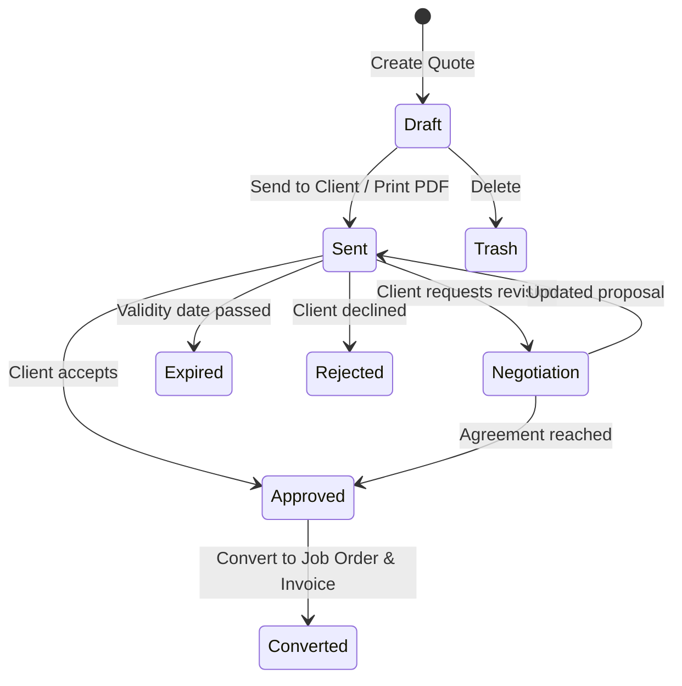

# UX Specification: Quotations Module (কোটেশন ও প্রস্তাবনা)

## 1. Executive Summary & Purpose
The Quotations module is PrintFlow's commercial frontline. Its primary job to be done (JTBD) is helping the business owner, estimator, and sales managers answer:
> **"Which high-value proposals need immediate follow-up to close today, and what is our win rate?"**

Every interaction must be actionable within **$\le 3$ clicks from the Dashboard**:
1. **Click 1:** Dashboard Quick Action: "+ New Work" or Navigation to "Quotations".
2. **Click 2:** Choose Customer & Add Product / Custom Specifications with real-time costing.
3. **Click 3:** Issue Quotation & Print PDF / Send via WhatsApp.

---

## 2. Information Hierarchy & First Screen
The first screen strictly answers **"What needs my attention now?"**:

### A. Canonical 4-KPI Row (Fixed Height, No Clutter)
1. **Active Pipeline Value (চলতি পাইপলাইন):** Total value and count of pending proposals awaiting customer confirmation.
2. **Accepted & Converted (অনুমোদিত ও অর্ডার):** Value and percentage converted to live job orders this month.
3. **Expiring Soon (মেয়াদ শেষের পথে):** Quotes with $< 48$ hours of validity remaining requiring immediate closing action.
4. **Follow-Up Needed Today (আজকের ফলো-আপ):** Proposals flagged for follow-up call, negotiation, or WhatsApp contact.

### B. Prioritized Work List ("Needs Attention Now")
A prioritized queue above or alongside the directory listing critical items:
- Critical expiring quotes (color-coded badge, remaining hours).
- High-value deals awaiting customer response ($> ৳ 50,000$).
- One-click action button for each: **"Log Follow-up"**, **"Send WhatsApp"**, **"Convert to Order"**.

### C. Comprehensive Quotation Directory
Full tabular list with sticky header, URL-synced search/filters, and card fallback on mobile.

---

## 3. List Page Architecture
1. **URL-Synced Filter Bar:**
   - Text Search (`?q=...`): Quote number, customer name, phone, item description.
   - Status Filter (`?status=...`): `all`, `draft`, `sent`, `negotiation`, `approved`, `converted`, `expired`, `rejected`.
   - Date Period (`?period=...`): `today`, `this_week`, `this_month`, `custom`.
   - Branch Filter (`?branch=...`): Multi-branch support when enabled.
2. **Directory Table:**
   - **Sticky Header:** Columns stay anchored on scroll.
   - **Columns:** Quote #, Customer, Sector/Item, Date & Validity, Total Amount (BDT tabular), Status Timeline, Actions.
   - **Responsive Breakpoint (<768px):** Switches automatically to rich touch cards with glove-friendly touch targets ($\ge 44\text{px}$).
   - **Bulk Actions:** Multi-select quotes to export CSV, mark expired, or send reminders.
   - **Empty State:** Explicit call-to-action button: *"+ Create First Quotation"* with helpful guidance for zero-catalog vs catalog workflows.

---

## 4. Form Design & Quoting Engine
- **Sectioned Layout:**
  1. Customer Selection (Search existing or quick-add new customer).
  2. Specification & Line Items (Digital print, offset, 3D signage, or custom zero-catalog items with dimensions: W × H, SQFT/SQIN, quantity).
  3. Costing & Margin Engine (Real-time material, finishing, labor calculation).
  4. Discounts, VAT (0%, 5%, 7.5%, 15%), and Grand Total in BDT.
  5. Terms & Validity (Default 7 days, payment milestones).
- **Autosave & Draft Guard:**
  - Automatically saves draft changes to prevent data loss on accidental navigation.
  - Warns with unsaved-changes guard when navigating away with dirty forms.
- **Button Invariant:** Single primary submit button (`disabled-while-submitting`), spinner state, no double submissions.

---

## 5. Status Workflow & Valid Transitions

- **Guaranteed Invariant:** Only valid next actions are clickable in UI and enforced on server action. Converted quotes cannot be edited without authorization.

---

## 6. Money, Dates & Localization
- **Currency:** Bangladeshi Taka (`৳` / BDT) with standard Indian/South Asian grouping (`1,25,000.00`).
- **Dates & Timezone:** Relative dates (e.g., "Expiring in 2 days", "আজকের তৈরি") with absolute date/time tooltip in `Asia/Dhaka` (UTC+6).
- **Languages:** Full parity across English (`en`) and Bengali (`bn`).

---

## 7. Resilience & Error Boundaries
- `loading.tsx`: Layout skeleton matching exact 4-KPI cards + table geometry to guarantee zero layout shift (CLS).
- `error.tsx`: Scoped route error boundary with request ID, error digest, and retry button.
- `not-found.tsx`: Clean semantic 404 message for non-existent quotation IDs.

---

## 8. Verification Matrix
- **UI Audit:** 0 raw palette classes, 0 hardcoded text-white/bg-black, $\ge 12\text{px}$ typography.
- **Playwright Test:** End-to-end create $\to$ edit $\to$ status change $\to$ PDF print verification across Light/Dark, Mobile 375px/Desktop 1440px, and EN/BN.
