# InkFlow ERP — GitHub Actions CI & Branch Protection Standards

## 1. Zero Silent Regressions Guarantee

To prevent regressions in multitenancy, design system tokens, database RLS, and security boundaries, every Pull Request (PR) must execute and pass the **Full Enterprise Gate** defined in `.github/workflows/ci.yml`.

---

## 2. CI Verification Pipeline Breakdown

```mermaid
flowchart LR
    Checkout[1. Checkout & Node 24] --> Install[2. npm ci with Lockfile Pin]
    Install --> Quality[3. Typecheck & Lint]
    Quality --> Audits[4. UI Audit & Copy Lint]
    Audits --> SecGrep[5. Security Grep Gate]
    SecGrep --> Licenses[6. Permissive License Audit]
    Licenses --> Migrations[7. Postgres Container & RLS Verification]
    Migrations --> Tests[8. Full Automated Test Suite]
    Tests --> Build[9. Production Next.js Build]
```

### Steps Executed on Every PR:
1. **Dependency Pinning:** `npm ci` validates exact lockfile parity without floating dependencies.
2. **Typecheck:** `tsc --noEmit` validates 100% strict TypeScript types across 600+ components, actions, and services.
3. **ESLint:** Code standard and best practice validation.
4. **Copy Lint (`copy-lint`):** Checks for banned raw strings, missing translations, or improper bilingual formatting.
5. **UI Audit (`ui-audit`):** Scans all application markup for zero raw Tailwind palette colors (e.g. `bg-slate-*`, `text-indigo-*`), zero gradients/glows, and strict design token adherence.
6. **Security Grep Gate (`security-grep`):**
   - 0 `grant execute ... to anon` or `public` on security definer functions.
   - 0 `using (true)` or `with check (true)` on any of the 34 tenant-scoped tables.
   - 0 `SUPABASE_SERVICE_ROLE` in any client components or client bundles.
7. **License Compliance (`check:licenses`):** Ensures 100% of production dependencies use permissive licenses (MIT, Apache-2.0, BSD, ISC).
8. **Live Migration Verification (`test:migrations`):** Spins up a live `postgres:16-alpine` service container, applies all 120+ database migrations sequentially, and runs `verify_multitenant_rls.sql` to verify FORCED RLS on 100% of tenant tables.
9. **Automated Test Suite (`npm test`):** Executes 2,300+ unit, integration, security, role boundary, and acceptance tests.
10. **Production Build (`next build`):** Verifies Webpack/Turbopack bundling, server/client tree-shaking, and route configuration.

---

## 3. GitHub Branch Protection Configuration (`main`)

To enforce this gate on the repository:

1. In GitHub, navigate to **Settings** $\to$ **Branches** $\to$ **Add branch protection rule**.
2. Branch pattern name: `main`.
3. Check the following enforcement invariants:
   - **Require a pull request before merging:**
     - Require approvals: $\ge 1$.
     - Dismiss stale pull request approvals when new commits are pushed: **Enabled**.
   - **Require status checks to pass before merging:**
     - Require branches to be up to date before merging: **Enabled**.
     - Status checks that must pass:
       - `CI / Full Enterprise Gate (Node 24.x)`
   - **Require linear history:** **Enabled** (all merges must be squash-merged or rebased; no merge commits).
   - **Include administrators:** **Enabled** (Platform Owners and Repository Admins are bound by CI gates).
   - **Do not allow force pushes:** **Enabled**.
   - **Do not allow deletions:** **Enabled**.
